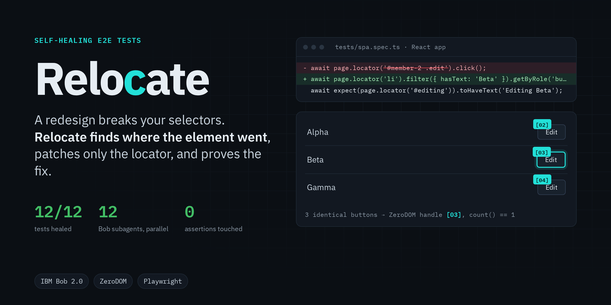
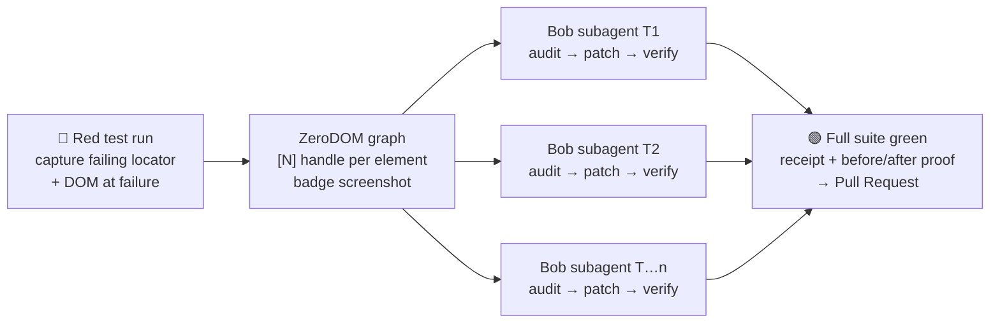
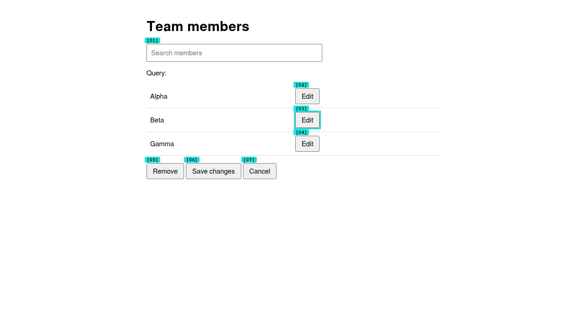
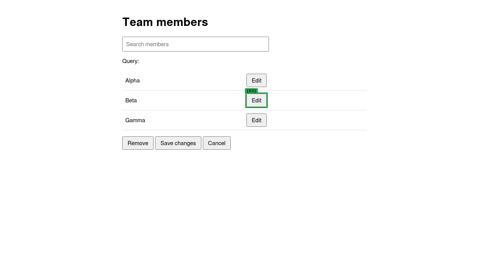
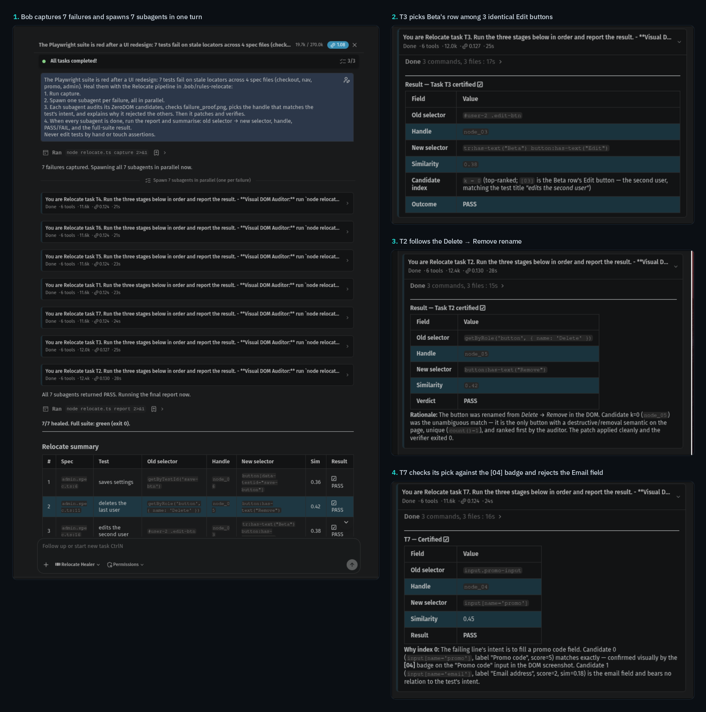

<p align="center">
  
  <a href="https://www.npmjs.com/package/@vexralabs/zerodom"></a>
  
  
  
  <a href="LICENSE"></a>
  <br>
  
  
  
  
</p>

# Relocate: autonomous healer for broken UI tests

A UI redesign renames an id, rewords a button, drops a `data-testid`, and twelve Playwright tests go red.
Nothing is actually broken except the tests' locators.

**Why it matters.** Today someone fixes that by hand, test by test: read the trace, open the page, find where
the element went, write a new selector, re-run. Or they give up, `test.skip()` it, and lose the coverage.
Relocate turns that afternoon into one prompt. In our run, **12 broken tests across a static site and a
React app became a verified, merge-ready PR**, with no assertion touched.

**Relocate fixes them by itself.** For each failure it:
1. saves the page exactly as it was when the test failed;
2. maps every interactive element with [ZeroDOM](https://github.com/DevHusnainAi/zerodom) (`@vexralabs/zerodom`), which
   gives each one a collision-free `[N]` handle and a selector that matches exactly one element;
3. picks the element the test meant, patches **only the locator**, re-runs the test, and opens a PR with visual proof.

**IBM Bob 2.0** runs the whole thing: **one subagent per failing test, all running at once.**



## Results: IBM Bob run, 12 broken tests

Two redesigned apps, both served to the tests exactly as a browser sees them:

- **Static site** (`demo-app/index.html`, `admin.html`): renamed ids, classes and test ids, reworded labels, a
  new wrapper `<div>`, three identical **Edit** rows, and a decoy **Submit feedback** button.
- **React app** (`demo-spa/`, built with Vite): CSS-module **build hashes**, UI text moved into a translations
  file, a test id **composed from props** (`${formId}-${action}`), and a new `MemberRow` component with no row ids.

| | |
|---|---|
| Tests healed | **12 / 12**, all on the first pick, no fallbacks |
| Full suite after heal | **12 passed, 0 failed** (exit 0) |
| Bob subagents | **12, spawned in one turn** |
| Cost | **1.74 Bobcoins**, 23.7k tokens |
| Assertions changed | **0**: 12 one-line locator swaps |
| Brittle selectors written | **0** positional, **0** build-hash |

| Test | Stale locator | What changed | Healed to |
|---|---|---|---|
| saves settings | `getByTestId('save-btn')` | testid renamed | `getByTestId('save-button')` |
| deletes the last user | `getByRole('button', { name: 'Delete' })` | label reworded to **Remove** | `getByRole('button', { name: 'Remove' })` |
| edits the second user | `#user-2 .edit-btn` | row ids dropped; **3 identical "Edit" buttons** | `locator('tr').filter({ hasText: 'Beta' }).getByRole('button', { name: 'Edit' })` |
| searches members | `getByPlaceholder('Search users')` | placeholder reworded | `getByPlaceholder('Search members')` |
| checkout places an order | `button#submit-v1` | id renamed; **decoy "Submit feedback"** next to it | `locator('#place-order')` |
| cart link opens the cart | `nav > a.cart-link` | class renamed, wrapped in a `<div>` | `locator('a.nav-link--cart')` |
| promo code is accepted | `input.promo-input` | class renamed | `locator('input[name="promo"]')` |
| saves team settings *(React)* | `button._primary_DzAMk` | **build hash** changed; now **two** buttons share the new class | `getByRole('button', { name: 'Save changes' })` |
| removes the last member *(React)* | `getByRole('button', { name: 'Delete member' })` | label moved to translations, reworded | `getByRole('button', { name: 'Remove from team' })` |
| sends an invite *(React)* | `getByTestId('invite-submit')` | testid now composed from props | `getByTestId('invite-form-send')` |
| edits the second member *(React)* | `#member-2 .edit` | new `MemberRow` component, no ids, **3 identical "Edit" buttons** | `locator('li').filter({ hasText: 'Beta' }).getByRole('button', { name: 'Edit' })` |
| filters members *(React)* | `getByPlaceholder('Search members')` | placeholder moved to translations, reworded | `getByPlaceholder('Find a teammate')` |

Two cases are hard on purpose. Three identical **Edit** buttons: ZeroDOM gives each its own handle, the row
text ("Beta", from the assertion `Editing Beta`) picks `[03]`, and the fix targets **Beta by name**, not
"the second row". A stale **build hash**: the new hash (`_solid_h-dyu`) is shared by *Save changes* and
*Send invite*, so Relocate refuses it and writes the accessible name instead.

| At failure: every element badged, `[03]` chosen | After heal: verified target |
|---|---|
|  |  |

### IBM Bob at work

Bob captures the failures, then **spawns one subagent per failure in a single turn** (12 in the latest run).
Each subagent reviews its ZeroDOM candidates against the badge screenshot and writes down why it picked one
handle and rejected the others. The screenshots below are from our first Bob run (7 tests); the 12-test run's
full export is in [`bob_sessions/run3-12-subagents/`](bob_sessions/run3-12-subagents/).



The full session export and every subagent's reasoning are in [`bob_sessions/`](bob_sessions/).

**See the result:** [PR #1: Relocate heals 12 stale locators](https://github.com/DevHusnainAi/relocate/pull/1). It contains the 12 one-line fixes Bob made, plus before/after screenshots for every test. `main` is kept red on purpose so you can reproduce the run.

## Plain Bob vs Relocate

Couldn't plain IBM Bob just do this? We tested it six times. Each run used a fresh copy of the broken tests
with **no Relocate, no custom mode, and nothing in the project mentioning either**, in Bob's default Agent
mode. We checked each run's real `git diff` and re-ran the suite ourselves.

| Run | App | Prompt | Outcome | Duplicate-row fix | Bobcoins |
|---|---|---|---|---|---|
| Plain Bob 1 | static site | "…Fix the failing tests." | ❌ **Reverted the redesign in the app** | – | 0.483 |
| Plain Bob 2 | static site | same prompt | ✅ 7/7, tests only | `tr[data-id="2"] .btn-edit` | 0.659 |
| Plain Bob 3 | static site | "…don't change the app. Update the tests." | ✅ 7/7, tests only | `tr[data-id="2"] .btn-edit` | 0.266 |
| Plain Bob 4 | React app\* | same as run 3 | ✅ 5/5, tests only | ⚠️ `ul li:nth-child(2) button` | 0.402 |
| Plain Bob 5 | React app | same as run 3 | ✅ 5/5, tests only | ⚠️ `locator('li').nth(1)…` | not recorded |
| Plain Bob 6 | React app, **built app only** (QA repo)† | same as run 3 | ✅ 5/5, tests only | ⚠️ `locator('li').nth(1)…` | not recorded |
| **Relocate** | both, 12 tests | Relocate Healer mode | ✅ 12/12, proof + PR | ✅ `locator('li').filter({ hasText: 'Beta' })…` | 1.74 |
| **Relocate (CLI)** | run 6's QA repo, **built app only** | `node relocate.ts heal` | ✅ 5/5, proof | ✅ `locator('li').filter({ hasText: 'Beta' })…` | 0 (no Bob) |

\* Run 4's folder still had our failure-capture fixture, and Bob used its saved page ("*The DOM snapshot gives
me everything I need*"). Run 5 was a plain Playwright project; Bob read the React source and translations instead.

† Run 6 is how many QA teams work: the tests live in their own repo and only the built app is available.
With no source to read, plain Bob **improvised Relocate's first stage itself**: *"The HTML is just a shell — the
content is rendered by the JS bundle. Let me use Playwright itself to dump the rendered DOM."* In the same
folder, with no source either, [Relocate healed 5/5](bob_sessions/baseline-plain-bob/run6-react-qa-repo/relocate-same-folder/)
and targeted the duplicate row by name.

**What we found:**

- **Plain Bob is capable.** In 5 of 6 runs it fixed only the tests, and cheaper than Relocate. With the app's
  source next to the tests it reads the source; without it, it wrote a script to capture the rendered page,
  which is exactly the step Relocate ships as a tested component.
- **But not reliable.** With the identical prompt it once decided *"the tests are the source of truth"*, then
  relabelled "Remove" back to "Delete" and deleted the new layout. Merged, that would have silently undone the
  redesign while the suite reported green. The next run fixed the tests instead.
- **And its fixes can be fragile.** In **all 3** React runs it targeted the duplicate row **by position** ("the 2nd
  list item"), reasoning once that this should *"presumably"* work. Add or sort a member and that test clicks the
  wrong person or breaks. Relocate targets **Beta by name**.
- **And none of it is checkable.** Plain Bob *chose* to leave assertions alone. Relocate **enforces** it: in its
  mode Bob can't write app or test files, `relocate.ts patch` rejects any change beyond one locator, positional
  and build-hash selectors are never written, and every fix is re-run and shipped with proof.

**Relocate isn't more capable than Bob. It makes Bob reliable and checkable,** for about 0.1 Bobcoin more per test.

Full evidence for every run, with exports, diffs and suite output: [`bob_sessions/baseline-plain-bob/`](bob_sessions/baseline-plain-bob/).

## How it's different

| Common approach | Its problem | Relocate |
|---|---|---|
| **Runtime self-healing** (fallback locators at run time) | The test goes green, but the source stays broken and the drift is hidden | Fixes the **source** and ships the change as a reviewable PR |
| **Ask an LLM for a new selector** | Guessed CSS, ambiguous `(role, name)` pairs, a confident click on the wrong element | Picks from ZeroDOM's **verified handles**; every candidate must match `count() == 1` on the real page |
| **Let an agent edit the test** | It can "fix" a test by loosening or deleting assertions | Only the locator can change; the patch is rejected otherwise, and Bob can't write to test files in this mode |
| **Heal one failure at a time** | Slow on a big redesign | **One Bob subagent per failure, all in parallel** |
| **A general coding agent** | Picks which side to fix, and how, itself. Plain Bob [reverted the redesign once and wrote positional fixes 3 times](bob_sessions/baseline-plain-bob/) in 6 runs | The page is the truth; app and assertions can't be touched; positional and build-hash selectors are never written |

## Quickstart

```bash
npm install && npx playwright install chromium
npm run red      # 12 failing tests (stale locators)
npm run heal     # capture → 12 concurrent tasks → report + full-suite re-run   (~45 s)
npm run reset    # put the broken tests back for another run
npm test         # self-checks: ranking, duplicates, inflections, patching, brittle selectors
npm run build:spa  # rebuild the React app (its build output is committed)
```

`node relocate.ts heal --pr` also creates a branch, commits, and opens the PR via `gh`.

## With IBM Bob 2.0

Open the repo in Bob IDE and select the **🩹 Relocate Healer** mode (`.bob/custom_modes.yaml`). Then ask:

> The Playwright suite is red after a UI redesign. Heal the failing tests using the Relocate pipeline in
> .bob/rules-relocate: capture, then one subagent per failure in parallel, then the report.

The mode rules (`.bob/rules-relocate/`) make Bob:

1. run `capture` itself;
2. **spawn one subagent per failure, all at once.** Each subagent reads its ZeroDOM candidates and the badge
   screenshot, picks the handle that matches the test's intent, **explains why it rejected the others**,
   then patches and verifies;
3. run `report` when every subagent is done.

In this mode Bob can edit only Markdown. Test files can change only through `relocate.ts patch`, so an agent
can't "fix" a test by weakening its assertions.

| Command | Stage | FRD |
|---|---|---|
| `node relocate.ts capture` | Red run; parse the failing line and the locator Playwright was waiting for (`locator()`, `getByRole`, `getByTestId`, `getByPlaceholder`, …); DOM snapshot at failure | FR-1 |
| `node relocate.ts audit <n>` | ZeroDOM graph, ranked candidates, `count()==1` check, badge PNG | FR-2, FR-3.1 |
| `node relocate.ts patch <n> [k]` | Swap that one locator for candidate `k`; reject any other change | FR-3.2 |
| `node relocate.ts verify <n>` | Re-run that one test; one fallback candidate; restore the line if nothing passes | FR-3.3 |
| `node relocate.ts report [--pr]` | Terminal report, full-suite re-run, `receipt.json`, `PR.md`, optional PR | FR-4 |

## How the element is chosen

The old element no longer exists, so Relocate matches on **meaning**:

- **Stale locator words:** `getByTestId('save-btn')` → *save, btn*.
- **Test intent:** the test title plus the assertion after the failing line → *settings, saved*. Inflections
  match (*removed* ↔ **Remove**, *places* ↔ *place*).
- **Neighbouring context:** the text of the element's table row or list item. This is what separates
  identical buttons.
- **Action:** a `.fill()` only considers inputs; a `.click()` only considers clickable elements.
- **Uniqueness:** any candidate whose selector doesn't match exactly one element on the failure-time page is
  dropped.

The ranking is deterministic and explainable, and the scores go into the receipt. **Bob's subagents then
review the ranked list against the screenshot** and can overrule it.

### Readable selectors, in the test's own style

ZeroDOM's selectors are exact, but they can be positional (`body > button:nth-of-type(2)`) or carry a
CSS-module **build hash** (`button._solid_h-dyu`). Writing either into a test makes it *more* fragile than
before. So once ZeroDOM has found the element, Relocate writes what a person would, **in the style the test
already used**:

- a `getByTestId` / `getByRole` / `getByPlaceholder` test stays that method, with the new value;
- a CSS test gets an id, a `data-testid` / `name` / `aria-label` / `placeholder` attribute, or ZeroDOM's own
  selector when that isn't positional or hashed;
- a duplicate inside a list or table row becomes `locator('li').filter({ hasText: 'Beta' }).getByRole(…)`.

Each option must still match **exactly that same element**, or it's skipped. Text containing digits
(`Cart (0)`) is never used, because it's usually a live counter.

## Safety gates

| Gate | How it is enforced |
|---|---|
| GATE-01 Red state | `capture` accepts only locator timeouts; other failures are reported and skipped |
| GATE-02 Resolution | Every candidate and every written locator is checked for `count() == 1` on the failure DOM. ZeroDOM parse time: 0.7–21 ms standalone; 30–104 ms in the 12-subagent Bob run, with 12 browsers starting on one machine at once |
| GATE-03 Parallel subagents | Bob spawned all 12 subagents in one turn (see `bob_sessions/run3-12-subagents/`); `heal` runs tasks concurrently |
| GATE-04 Clean patch | `swapLocator` throws unless exactly one line changed and only its locator. A cross-process file lock keeps parallel subagents from overwriting each other's fixes in a shared spec file |
| GATE-05 Green state | Each healed test must exit 0 within 30 s; `report` then re-runs the whole suite |
| GATE-06 Receipt | `relocate-proof/<n>-failure_proof.png`, `<n>-healed_proof.png`, `receipt.json`, `PR.md` |

## Limitations

- Matching is word-based. A rename with no shared words and no hint in the test (e.g. "Go" → "Proceed" with
  a generic assertion) can rank the wrong element first. The verifier then tries the next candidate, then
  restores the original line and reports FAIL. It never forces a pass.
- It heals locators on one line of TypeScript Playwright tests. Page objects, helper functions and locators
  that match a list of elements (`toHaveText([...])`) are not handled yet.
- When the app's source is in the same repo, plain Bob can often make the same fix for less. There, Relocate's
  value is the guarantees and the proof, not capability (see *Plain Bob vs Relocate*).

## What's next

- **CI trigger:** a GitHub Action that runs Relocate when a PR turns E2E red and pushes the fix as a follow-up commit.
- **Page objects:** follow a locator into helper and page-object files, not just the failing line.
- **Stronger ranking:** add an IBM watsonx.ai embedding step for renames with no shared words, alongside Bob's own judgement.
- **More runners:** Cypress and Playwright Python use the same capture → ZeroDOM → patch loop.

## Demo script (~2 min)

1. **Setup:** the React app's redesign (translations, build hashes, new `MemberRow`). `npm run red` → **12 failed**.
2. **Bob fans out:** in Bob IDE, Relocate Healer mode, send the prompt. Show 12 subagents spawning at once.
3. **Why this one:** a subagent's reasoning for the duplicate **Edit** rows, and its `failure_proof.png`.
4. **Plain Bob, for contrast:** run 1's *"the tests are the source of truth"*, and the positional `nth(1)` fix.
5. **Green:** summary table, 12/12 PASS. `git diff tests` shows 12 one-line changes. Then the PR with before/after images.

## Layout

```
demo-app/index.html, admin.html   the redesigned static site (the tests were written for the old one)
demo-spa/                         the redesigned React app (Vite, CSS modules, translations)
demo-app/spa/                     its committed build, served to the tests
tests/*.spec.ts                   12 tests with stale locators across 5 spec files
tests/fixture.ts                  saves the DOM at the moment of failure
relocate.ts                       the whole pipeline (single file)
relocate.test.ts                  self-checks (node --test)
.bob/                             IBM Bob custom mode + orchestration rules
bob_sessions/                     exported Bob task + per-subagent reasoning screenshots
docs/                             images used in this README
```

## License

[MIT](LICENSE). ZeroDOM (`@vexralabs/zerodom`) is Apache-2.0.
